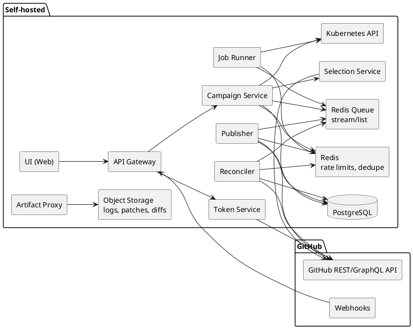
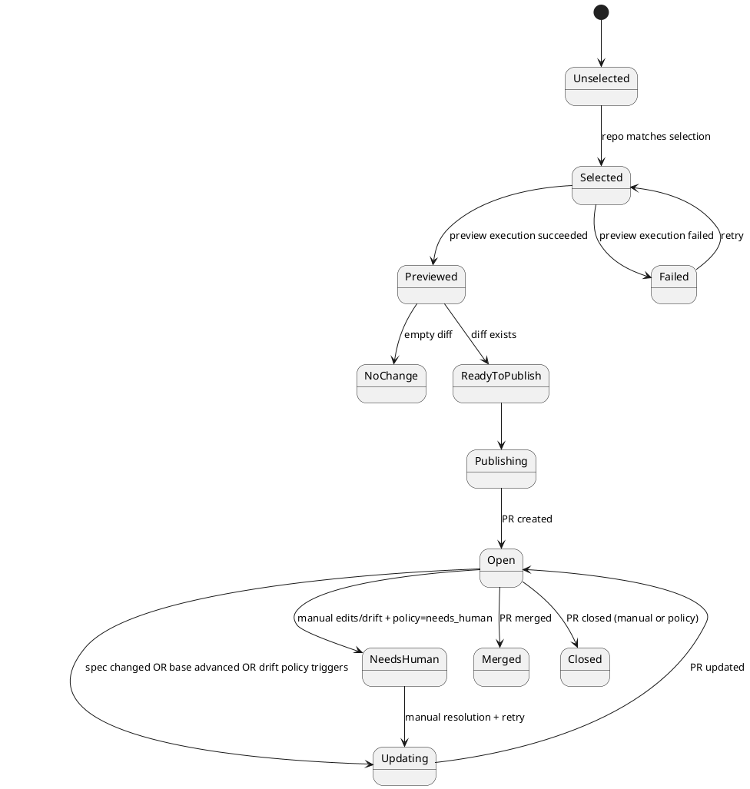
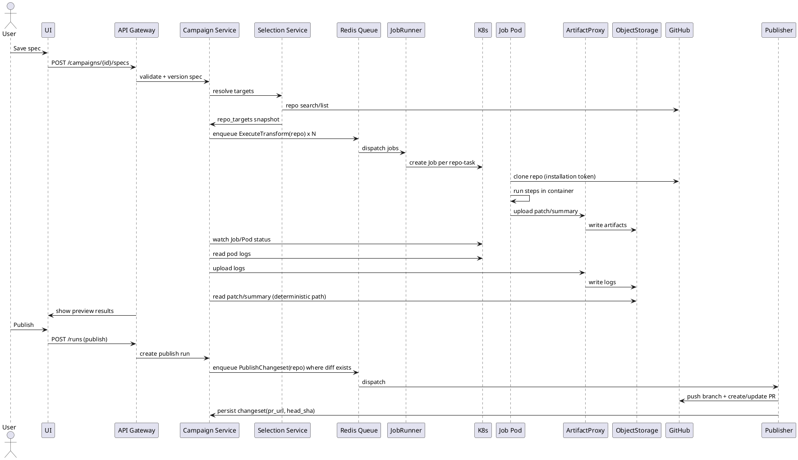

# SPEC-1-GitHub Campaigns for Bulk PRs

## Background

Engineering orgs regularly need to apply the same refactor, dependency upgrade, security fix, or policy change across many repositories. Manual, repo-by-repo updates are slow and error-prone and often devolve into unmanaged PR spam.

This spec describes a GitHub-organization-native system that lets users define a **declarative campaign spec** (repo selection + per-repo transformation + PR template), run it at scale, and then continuously **reconcile** the intended state against real GitHub PR state until completion—mirroring Sourcegraph Batch Changes’ “spec → changesets → controller” model.

## Requirements

### Must (P0)

* **Deployment**: Self-hosted (single-tenant per customer) on Kubernetes, capable of connecting to one or more GitHub orgs via GitHub App installations against a **configurable GitHub API base URL** (GitHub.com or GHES).
* **Scale & throttles**: Typical 1,000–1,500 repos per campaign, max 5,000; default publish throttle **150–200 PRs/day/org** (configurable).
* **GitHub App auth**: Installable on orgs (or selected repos), using fine-grained permissions; uses installation access tokens; respects org policies (SSO, required reviews/checks).
* **Campaigns + declarative specs**: Store campaign metadata and versioned spec; spec defines repo selection, steps, and PR template.
* **Preview run**: Resolve targets and execute transformations without writing to GitHub; show per-repo status (no change / patch / failed) and logs.
* **Publish run**: For repos with changes, create branch + commit + push + PR; apply PR template (title/body/labels/reviewers/assignees).
* **Reconcile loop** (webhooks + periodic): Keep PRs aligned with desired intent when (a) spec changes, (b) repo/base branch drifts, (c) repo no longer selected, (d) PR merges/closes.
* **Safety controls**: Per-org publish throttles; API concurrency caps; kill switch; pause/resume; idempotent jobs; **job concurrency caps per org**; branch protection awareness (never bypass checks).
* **Observability & audit**: Immutable audit log for actions; metrics for runs and API usage; link every PR/branch to campaign + spec version.
* **Execution sandboxing**: Per-repo Kubernetes Jobs with deterministic images, per-step timeouts, secret redaction, and egress disabled by default (allowlist optional).

### Should (P1)

* **Bulk actions**: Retry failures, close/remove targets, rebase/update all, update PR templates.
* **Drift policy options**: overwrite (force-push), open new PR, or mark “needs human” based on per-campaign policy.
* **Structured diff summaries**: Store git diff and file-level stats for UI rendering and search.
* **CLI**: Apply/preview/publish from terminal for power users.

### Could (P2)

* **Repo selection integrations**: CODEOWNERS/teams/catalog sources.
* **Auto-merge policies**: If checks + approvals satisfied, enable GitHub auto-merge (subject to org settings).
* **Follow-up workflows**: Post-merge tasks (e.g., open tracking issues, trigger deployments).

### Won’t (P3, for MVP)

* Cross-forge support (GitLab/Bitbucket).
* Arbitrary privileged network access in workers by default.

## Method

### High-level architecture

**Control plane** (API + orchestration + reconciliation) maintains declarative intent and turns it into idempotent **tasks** placed onto Redis, with durable state in PostgreSQL.

**Data plane** (Kubernetes Jobs) executes repo transformations in sandboxed containers and produces patches/diffs.

**Deployment target**: Kubernetes with **customer-provided external endpoints** for PostgreSQL, Redis, and S3-compatible object storage (e.g., MinIO/S3).

### Core controller model

For each campaign, we maintain:

* **Desired state**: derived from `(CampaignSpec version, repo target set, execution result)`.
* **Actual state**: fetched from GitHub (PR/branch/head SHA/checks/reviews/merge state).

The **Reconciler** computes a per-repo DesiredChangeset and enqueues idempotent actions to converge actual → desired.

Key invariants:

* Jobs are **idempotent** and keyed by a deterministic **dedupe_key** (e.g., `campaign_id + repo + desired_patch_hash + action`).
* Branch names are deterministic (e.g., `campaign/<campaign_id>/<spec_version>/<repo_slug>`), so we can safely re-run.

### Data model (relational)

**PostgreSQL** is the source of truth for campaigns, desired/actual state, and audit.

Tables (key columns):

* `github_installations(id, api_base_url, installation_id, account_login, app_id, private_key_ref, webhook_secret_ref, created_at)` *(api_base_url supports GitHub.com or GHES)*
* `campaigns(id, installation_id, name, description, created_by, status, created_at)`
* `campaign_specs(id, campaign_id, version, raw_yaml, normalized_json, created_by, created_at)`
* `runs(id, campaign_id, spec_version, kind {preview|publish}, triggered_by, status, started_at, finished_at)`
* `repo_targets(id, campaign_id, repo_full_name, repo_node_id, selected_bool, selection_reason, excluded_reason, last_evaluated_at)`
* `executions(id, run_id, repo_full_name, status, started_at, finished_at, logs_uri, patch_uri, diff_stats_json, exit_code, error_code)`
* `changesets(id, campaign_id, repo_full_name, desired_spec_version, desired_patch_hash, desired_branch, drift_policy,
             state, pr_number, pr_node_id, pr_url, head_sha, base_sha, last_synced_at, last_error)`
* `audit_log(id, actor_type {user|system}, actor_id, campaign_id, repo_full_name, action, github_delivery_id, details_json, created_at)`

Object storage holds large blobs:

* execution logs, patches, rendered diffs, optional build artifacts.

### Declarative spec (MVP shape)

YAML is stored verbatim and normalized to JSON for deterministic hashing and validation.

* `targets`: org + query/inventory + exclusions
* `steps`: ordered containerized commands (with pinned images)
* `changesetTemplate`: branch/commit/PR template + metadata
* `policies`: publish throttle, drift handling, rebase policy, close-on-unselect

A **spec hash** and a per-repo **desired hash** are computed:

* `spec_hash = sha256(normalized_spec_json)`
* `desired_patch_hash = sha256(patch_bytes)` (or hash of normalized diff)

### Repo selection

* Use GitHub GraphQL for bulk reads (repo search + pagination); cache stable metadata.
* Persist the selected repo set into `repo_targets` for the run (so future spec edits are diffable).

### Job execution contract

Input:

* repo clone URL (HTTPS)
* base ref (default branch or pinned ref)
* `steps[]` (image + command + env + timeout)
* sandbox policy (default: no egress)

Output:

* exit status
* patch/diff (or “no change”) uploaded **via Artifact Proxy** and stored in object storage at a deterministic path
* structured summary (files changed, insertions/deletions, lockfile touched, tests run) uploaded **via Artifact Proxy** and stored in object storage
* logs emitted to stdout/stderr (collected via Kubernetes logging)

### Publisher behavior

Given `patch_uri` and `desired_branch`:

1. Checkout base commit.
2. Apply patch and create a commit with deterministic author + message.
3. Push branch (force-push only if policy allows).
4. Create or update PR + template.

**GitHub API notes** (implementation detail):

* Prefer **REST for writes** (refs + PRs) and **GraphQL for bulk reads**.
* Installation access tokens expire after ~1 hour; Token Service must auto-refresh. (See GitHub App installation auth docs.)

### Reconcile loop triggers

* Webhooks: `pull_request`, `push`, `check_run`, `check_suite` (plus others as needed).
* Periodic sync: backstop in case webhooks are delayed/missed.

Reconciler work per changeset:

* Fetch PR/branch/head SHA.
* Decide transitions (merged/closed/check failures/requires update).
* Enqueue `UpdatePRBranch`, `Rebase`, `ClosePR`, `RefreshStatus` jobs.

### Rate limiting strategy

* Two layers:

  1. **Publish throttle**: 150–200 PRs/day/org (configurable).
  2. **API throttle**: token-bucket per installation + concurrency caps; exponential backoff on secondary rate limits.

### Redis task queue design

**Choice**: Redis **Streams** with consumer groups for durability and backpressure.

* Stream: `campaign_tasks`
* Consumer groups:

  * `job-runner` group (consumes `ExecuteTransform`)
  * `publisher` group (consumes `PublishChangeset`, `ClosePR`, `UpdatePRBranch`, `Rebase`)
  * `reconciler` group (consumes `RefreshStatus`, `ReconcileRepo`)
* Message envelope (JSON):

  * `task_id` (uuid)
  * `task_type`
  * `campaign_id`, `run_id`, `spec_version`, `repo_full_name`
  * `dedupe_key`
  * `created_at`, `not_before`
  * `attempt`, `max_attempts`
  * `payload` (type-specific)

Reliability mechanics:

* Use `XREADGROUP` for consumption + `XACK` on success.
* Stalled work recovery:

  * `job-runner` periodically checks `XPENDING`/`XCLAIM` to reclaim tasks whose worker died.
  * A task is considered “stalled” if no ack within `visibility_timeout` (e.g., 30 minutes for transforms; 10 minutes for GitHub writes).
* Deduplication:

  * `SETNX dedupe:<dedupe_key> = task_id` with TTL (e.g., 24h) prevents duplicate in-flight work.
  * Postgres remains the terminal authority (replays are safe).
* Throttles/caps stored in Redis:

  * `rate:publish:<installation_id>:<yyyymmdd>` counters + rolling window.
  * `conc:jobs:<installation_id>` semaphore (implemented via Redis atomic INCR/DECR with TTL).

### Artifact Proxy (required)

**Goal**: Jobs never receive object-storage credentials; all artifact I/O goes through a single hardened service.

#### Artifact naming + retention

* Deterministic prefix:

  * `campaigns/<campaign_id>/runs/<run_id>/<repo_slug>/`
* Objects:

  * `patch.tar.gz` (or `patch.diff`)
  * `diff_summary.json`
  * `logs/<pod_name>.log.gz`
  * optional: `artifacts/<name>`
* Retention policy (configurable): default 30 days for logs/patches; keep merged campaign metadata indefinitely.

#### API (internal)

* `POST /v1/artifacts` (upload)

  * Auth: short-lived **artifact token** (JWT) scoped to `{campaign_id, run_id, repo_full_name, allowed_prefix}`
  * Body: multipart (metadata + bytes) or streamed upload
  * Returns: `{artifact_uri, sha256, size_bytes, content_type}`
* `GET /v1/artifacts/{artifact_uri}` (download)

  * Auth: internal service token (UI/API callers) or pre-signed redirect
* `POST /v1/artifacts/{artifact_uri}:delete` (optional, for cleanup)

#### Auth model

* Services authenticate to Artifact Proxy using **Kubernetes service account identity** (recommended: projected service account JWT) and per-request signed tokens.
* `job-runner` mints an **artifact token** per Job and injects it as an env var. Token TTL: 1–2 hours.
* Artifact Proxy validates token and enforces prefix scoping; rejects path traversal and oversize uploads.

#### Hardening defaults

* Size limits per artifact (e.g., 50MB patch, 200MB logs per repo; configurable).
* Virus/malware scanning hook (optional P1).
* Encrypt-at-rest in object storage (SSE-S3/SSE-KMS where available).

### Kubernetes watch + log collection

Because Jobs do not callback:

* **Campaign Service** runs shared informers (watchers) on:

  * `batch/v1 Jobs` and `core/v1 Pods` filtered by labels: `campaign_id`, `run_id`, `repo_full_name_hash`.
* On Job completion:

  * Determine success/failure from Job conditions.
  * Pull logs via `GET /api/v1/namespaces/{ns}/pods/{pod}/log` (stream).
  * Upload logs through Artifact Proxy; store `executions.logs_uri`.
  * Read patch/summary URIs produced by the Job (see below) and store `executions.patch_uri`.

How Jobs expose produced artifact URIs:

* Job writes a small JSON “result file” to an `emptyDir` volume.
* Campaign Service retrieves it via `kubectl cp`-equivalent using the K8s API (exec + tar stream) **or** by reading it from a small sidecar that exposes it over localhost.
* Preferred MVP: a lightweight **result sidecar** that serves `/result.json` on `localhost` only; Campaign Service reads it via `pods/portforward`-style API.

RBAC (minimum):

* `job-runner`: create/list/get/watch Jobs; create Pods implicitly; get Events.
* `campaign-service`: list/get/watch Jobs and Pods; read Pod logs; optional delete Jobs (cleanup override).

### Security & compliance (self-hosted) (self-hosted)

* Secrets stored encrypted (KMS/Vault).
* Jobs do **not** receive object-storage credentials; all artifact writes go through **Artifact Proxy**.
* Workers run as non-root, no privileged mode, read-only root FS, resource limits.
* Default deny egress; optional allowlist.
* All GitHub mutations are written to `audit_log` with correlation IDs.

### Preview / publish sequence

## Implementation

### 1) Kubernetes packaging (Helm)

* Ship as a Helm chart with:

  * Deployments: `api-gateway`, `campaign-service`, `selection-service`, `publisher`, `reconciler`, `token-service`, `job-runner`, `artifact-proxy`, `ui`.
  * **Per-repo execution**: Kubernetes **Jobs** created by `job-runner` for each repo-task (preview, rerun, and spec updates).
  * **External dependencies (customer-managed)**: Postgres, Redis, object storage (configured via Helm values).
  * Ingress + TLS, NetworkPolicies (default deny for Job pods), Pod Security Standards (restricted).
  * Optional: KEDA/HPA for control-plane services (scale on API + queue depth).

### 2) GitHub App & installation bootstrap

* Admin creates/installs GitHub App on org(s) with least-privilege permissions.
* Store `api_base_url`, `installation_id`, and webhook secret per installation.
* Implement Token Service to mint short-lived installation access tokens on demand (cached with expiry).

### 3) Spec ingestion + validation

* Define a JSON schema for the YAML spec and validate server-side.
* Normalize YAML → canonical JSON (stable ordering) and compute `spec_hash`.
* Persist versioned `campaign_specs` and immutable run snapshots.

### 4) Repo selection engine

* Implement GitHub GraphQL-based search + pagination.
* Materialize results into `repo_targets` for each run, capturing inclusion/exclusion reasons.
* Add caching for repo metadata and default branch.

### 5) Redis queue + idempotent task runner

* Use **Redis Streams** as the queue (`campaign_tasks`) with consumer groups per worker role.
* Keep **PostgreSQL as source of truth** for task intent and outcomes (`runs`, `executions`, `changesets`).
* Idempotency & dedupe:

  * `dedupe_key = sha256(campaign_id + repo + spec_version + task_type + desired_patch_hash)`
  * Use Redis `SETNX` (with TTL) per `dedupe_key` to avoid duplicate in-flight work.
  * On completion, persist terminal state in Postgres so replays are harmless.
* Retries and dead-lettering:

  * `attempt` increments per retry; terminal failures after `max_attempts`.
  * Dead-letter stream `campaign_tasks_dlq` stores failed tasks for inspection.
* Rate limiting:

  * Token-bucket counters and semaphores stored in Redis per `installation_id` and per `campaign_id`.

### 6) Job execution (per repo-task)

* `job-runner` consumes `ExecuteTransform` tasks and creates a Kubernetes Job per repo-task.
* Job spec (recommended):

  * **initContainer**: clone repo into `emptyDir` workspace (shallow, base ref).
  * **main container**: run step runner (executes `steps[]` sequentially; enforces per-step timeouts).
  * **sidecar**: exposes `http://127.0.0.1:8080/result.json` containing artifact URIs + summary.
  * Volumes: `emptyDir` for workspace + results.
  * SecurityContext: non-root, readOnlyRootFilesystem, drop all caps, seccomp=RuntimeDefault.
  * Network: default deny egress; optional allowlist via NetworkPolicy.
* Artifact flow:

  * main container uploads patch + diff summary via Artifact Proxy using the injected artifact token.
  * main container writes `result.json` with `patch_uri`, `summary_uri`, `exit_code`, and `timings`.
* Result collection:

  * Campaign Service watches Job/Pod status.
  * On completion, Campaign Service pulls Pod logs via K8s API and uploads them via Artifact Proxy.
  * Campaign Service reads `result.json` from the sidecar and persists execution records.
* Cleanup:

  * `ttlSecondsAfterFinished` for Jobs, plus optional periodic sweeper for stuck resources.

### 7) Publisher

* For each repo with a patch:

  * Create/update deterministic branch.
  * Commit with deterministic author/message.
  * Create/update PR and apply template metadata.
* Persist `changesets` mapping to PR identifiers/URLs and SHAs.

### 8) Reconciler (controller loop)

* Webhook handlers write minimal events → enqueue `RefreshStatus` jobs.
* Periodic backstop sync enqueues refresh for “active” changesets.
* Reconcile decisions:

  * spec changed → rerun + update branch/PR.
  * base advanced → (optional) rebase policy.
  * unselected → close PR + delete branch (if enabled).
  * drift detected → apply configured drift policy.

### 9) UI (MVP)

* Campaign list + create.
* Spec editor with validation + preview.
* Run dashboard with filters (failed/no-change/ready/open/merged).
* Repo detail: logs, diff, PR link, retry.

### 10) Audit + metrics

* Emit audit events for every GitHub mutation and user-triggered action.
* Metrics: queue depth, job latency, run duration, per-step failure codes, GitHub API errors, publish throughput.
* Add Kubernetes metrics:

  * Job creation rate, Job failures by reason, log upload failures, Artifact Proxy error rates.
* Trace correlation:

  * Propagate `campaign_id`, `run_id`, `repo_full_name`, `task_id`, and GitHub `x-github-delivery` (webhook delivery ID) through logs/audit.

### Similar systems and why this architecture matches

* **Sourcegraph Batch Changes**: declarative spec → per-repo changesets + controller reconciliation (the direct inspiration).

* **Renovate / Dependabot**: PR-based automation at scale; validates the value of preview/PR templates, throttling, and ongoing update/rebase loops.

* **Ad-hoc bulk PR scripts**: prove the API surface is sufficient, but also highlight the missing pieces we provide (stateful preview, reconciliation, safety controls, and audit).

* Emit audit events for every GitHub mutation and user-triggered action.

* Metrics: queue depth, job latency, run duration, per-step failure codes, GitHub API errors, publish throughput.

## Milestones

1. **Foundations**: DB schema + basic API scaffolding + GitHub App installation record + token minting.
2. **Spec & selection**: spec schema/validation + GraphQL selection + repo_targets snapshot.
3. **Preview pipeline**: Redis queue + K8s Jobs + artifact proxy + log collection + preview UI.
4. **Publish pipeline**: branch/commit/PR creation + PR template + publish throttling.
5. **Reconciler loop**: webhook ingestion + periodic sync + update/close policies + drift detection.
6. **Hardening**: sandboxing defaults, network policies, audit log, dashboards/metrics, HA + backup docs.

## Gathering Results

### Acceptance checks

* Preview run correctly classifies targets into: no-change / patch / failed.
* Publish run creates ≤ configured PRs/day/org and never duplicates PRs.
* Spec edit triggers deterministic rerun and updates existing PRs to match intent.
* Webhook + periodic sync keep PR state accurate (checks/reviews/merge/closed).

### Operational SLOs (initial)

* 99% of webhook deliveries processed within 2 minutes.
* Worker execution success rate and top failure reasons visible.
* Controller reconciliation converges within 15 minutes for steady state.

### Post-deploy monitoring

* Alert on GitHub API errors, queue backlog, worker crash loops, and publish throughput below target.
* Monthly audit sampling: verify every GitHub mutation has an audit_log entry.

## Tech Stack

* FastAPI
* PostgreSQL
* Redis
* GitHub App
* Kubernetes
* GitHub GraphQL API
* GitHub REST API
* dxflrs/garage for Object Storage
* React for UI
